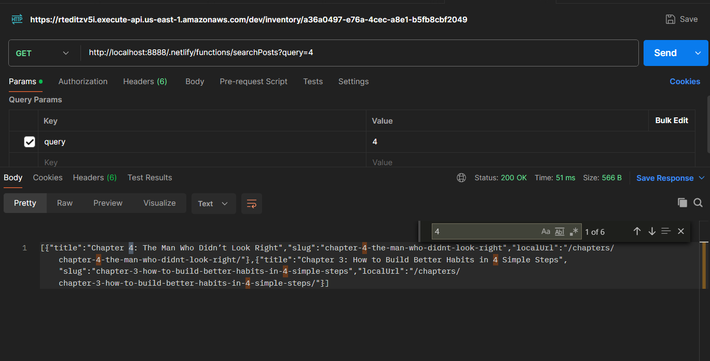
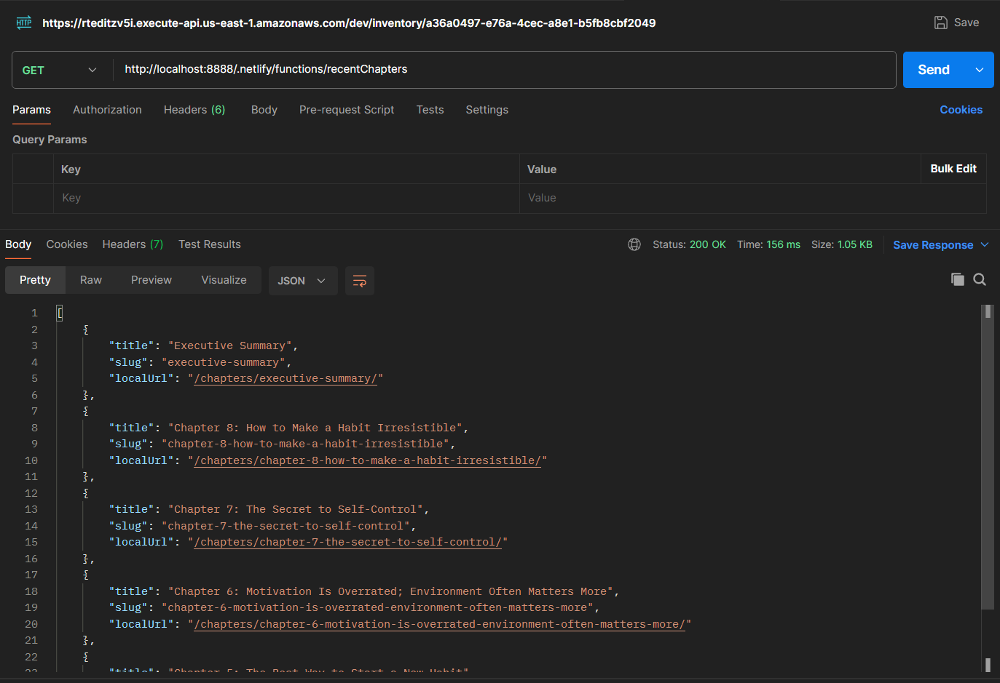
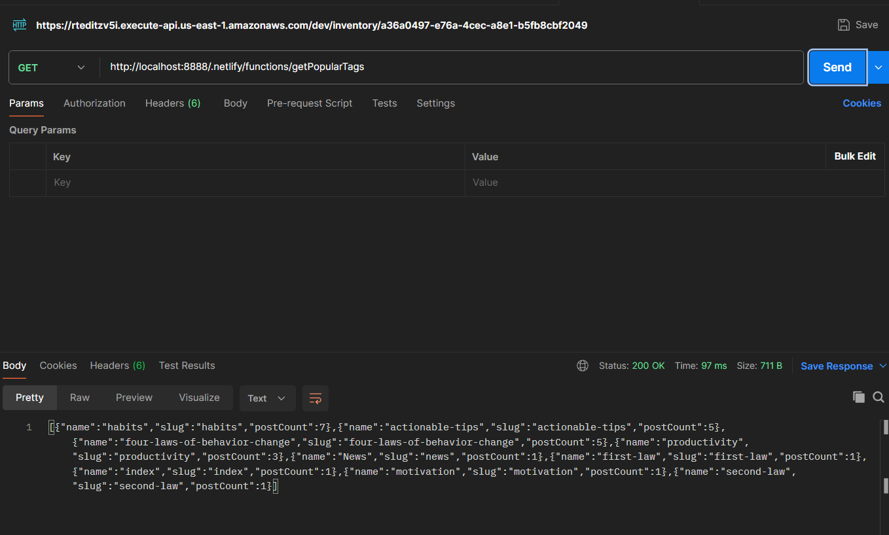
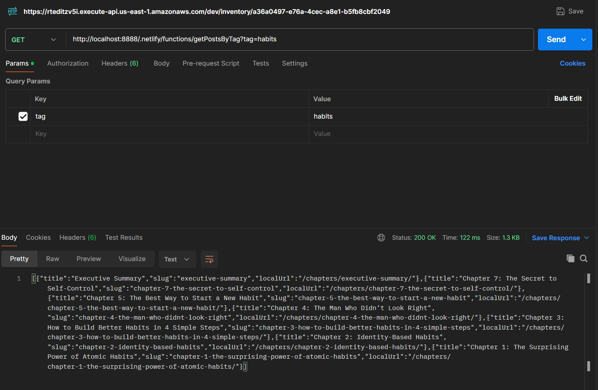
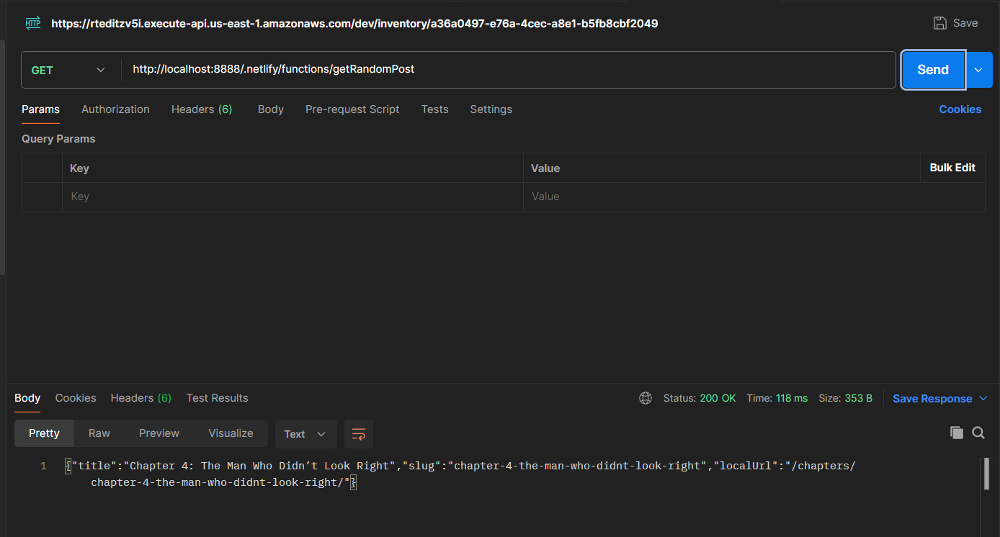
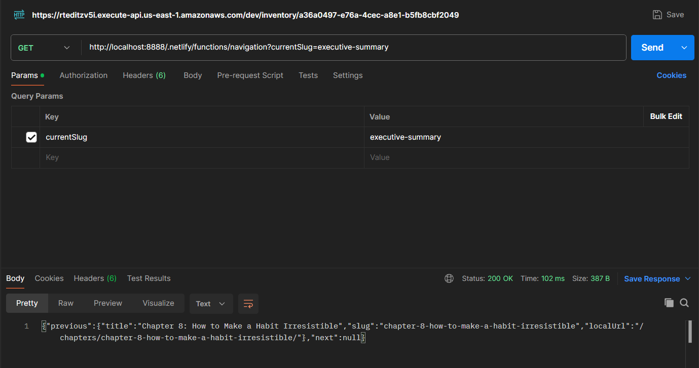

# **Atomic Habits Summary**

## **Project Overview**

- **Description**:  
  A static website built using Eleventy to summarize *Atomic Habits* by James Clear, integrated with serverless functions for dynamic content management.
- **Objective**:
  - Static site generation.
  - Dynamic content using serverless functions.
  - Headless CMS for managing content.

---

## **How to Run the Application**

### **Dependencies**
Before proceeding, ensure the following dependencies are installed:

- **Node.js**
- **npm**
- **Netlify CLI**
- **Ghost CMS** *(Installed locally as described below)*

### **Steps**

1. **Clone or Download the Repository**:
   ```bash
   git clone https://github.com/SM-7603/ASSIGNMENT_02_HEADLESS_CMS_ATOMIC_HABITS.git
   cd ASSIGNMENT_02_HEADLESS_CMS_ATOMIC_HABITS
   ```

2. **Install Dependencies**:  
   ```bash
   npm install
   ```

3. **Run Ghost CMS Locally**:
   - Ghost requires an empty directory for installation. Follow these steps:
     1. Create a new directory specifically for Ghost:
        ```bash
        mkdir ghost-local
        cd ghost-local
        ```
     2. Install Ghost locally:
        ```bash
        ghost install local
        ```
        **Note**: Ensure your system meets Ghost’s prerequisites (Node.js, MySQL, etc.). Refer to [Ghost’s Local Installation Guide](https://ghost.org/docs/install/local/) for more details.
     3. Start Ghost:
        ```bash
        ghost start
        ```
     4. Ghost will now be available at:
        - **Website**: [http://localhost:2368](http://localhost:2368)
        - **Admin Panel**: [http://localhost:2368/ghost](http://localhost:2368/ghost)
     5. Configure Ghost for API Access:
        - Log in to the **Admin Panel**.
        - Navigate to **Settings → Integrations → Add Custom Integration**.
        - Provide a name for your integration and copy the **Content API Key**.

4. **Setup `.env` File**:
   - Create a `.env` file in the root directory with the following content:
     ```env
     GHOST_API_URL=http://localhost:2368
     GHOST_API_KEY=<Your Ghost API Key>
     ```

5. **Run the Site Locally**:  
   Start the Netlify Dev server:
   ```bash
   npx netlify dev
   ```
   Visit [http://localhost:8888](http://localhost:8888).

---

## **Features**

1. **Dynamic Sidebar**:
   - **Search Bar**: Filter chapters dynamically using a serverless function that queries the Ghost CMS.
   - **Recent Chapters**: Displays the last 5 chapters added, powered by a serverless function.
   - **Popular Tags**: Fetches tags dynamically from the Ghost CMS, along with post counts.
   - **"Surprise Me" Button**: Navigates users to a random chapter for a fun, exploratory experience.

2. **Dynamic Chapter Navigation**:
   - Navigate to "Previous" and "Next" chapters dynamically using a serverless function.
   - Fully supports adding new chapters in Ghost without requiring manual updates to navigation links.

3. **Search Functionality**:
   - Search chapters using keywords powered by a serverless function.
   - Results are displayed dynamically in the sidebar, enhancing user experience.

4. **Headless CMS Integration**:
   - Managed via a Ghost CMS backend.
   - Content updates made in Ghost are immediately reflected on the website.

5. **Serverless Functions**:
   - Custom serverless functions handle dynamic content and asynchronous operations:
     - **Search Posts**: Finds chapters by title.
     - **Fetch Recent Chapters**: Retrieves the most recently added chapters.
     - **Fetch Posts by Tag**: Lists chapters associated with a specific tag.
     - **Fetch Random Post**: Returns a random chapter for dynamic exploration.
     - **Chapter Navigation**: Generates "Previous" and "Next" chapter links based on content order.

---

## **Serverless Functions**

### **Overview**
The following serverless functions power the dynamic content:

| Function Name        | Endpoint                          | Description                                      |
|----------------------|-----------------------------------|--------------------------------------------------|
| `searchPosts`        | `/searchPosts?query=<title>`     | Searches for chapters by title.                 |
| `recentChapters`     | `/recentChapters`                | Returns the last 5 published chapters.          |
| `getPopularTags`     | `/getPopularTags`                | Fetches tags sorted by post count.              |
| `getPostsByTag`      | `/getPostsByTag?tag=<tag-slug>`  | Fetches posts associated with a given tag.      |
| `getRandomPost`      | `/getRandomPost`                 | Returns a random chapter.                       |
| `chapterNavigation`  | `/chapterNavigation?slug=<slug>` | Fetches previous and next chapter links.        |

---

## **Screenshots**

### **Application in Action**

#### 1. **Serverless Functions**
- *Postman/Browser Screenshot Examples*:
  - `/searchPosts`: 
    - 
  - `/recentChapters`: 
    - 
  - `/getPopularTags`: 
    - 
  - `/getPostsByTag`:
    - 
  - `/getRandomPost`: 
    - 
  - `/navigation`: 
    - 

---

## **Checklist**

### **Requirements**
| Feature                   | Status   | Notes                          |
|---------------------------|----------|--------------------------------|
| Serverless Functions       | ✅ Done  | 5 functions implemented.       |
| Asynchronous Programming   | ✅ Done  | Used `fetch` and promises.     |
| Dynamic Content Handling   | ✅ Done  | Sidebar and navigation.        |
| State Management           | ✅ Done  | Search bar and navigation.     |
| Documentation      | 🚧 In Progress | Finalizing README.             |

---

## **Future Improvements**

1. **Styling Enhancements**:
   - Improve CSS for better user experience.
   - Add responsive design.

2. **Docker Integration**:
   - Create a Dockerized setup for easier replication.

3. **Deployment**:
   - Host Ghost CMS and deploy Netlify functions - *if the heroku team resolved my ticket*

---

## **Reflection**

### **What Worked**:
- Integrating Ghost CMS as the headless backend and using serverless functions to fetch dynamic content was a solid approach.
- The flexibility of Eleventy and Netlify's serverless functions allowed for rapid iteration and testing of features like dynamic navigation, tag-based filtering, and random chapter suggestions.

### **Challenges**:

1. **Heroku + Ghost CMS Fiasco**:
   - The original plan was to deploy Ghost CMS on Heroku using their free tier and leverage it as a remote, always-available backend.
   - However, Heroku’s account verification blocked adding critical add-ons (like Mailgun for transactional emails), even after verification. The Heroku support team had to step in & said that ticket would be resolved within 24 hours.
   - This led to the decision to switch to a local Ghost setup, ensuring full control over the CMS while documenting how to replicate it.

2. **Netlify Deployment + Serverless Functions**:
   - While Netlify’s serverless functions worked seamlessly during local development (`npx netlify dev`), deploying them revealed the hardcoded dependency on the local Ghost instance (`localhost:2368`).
   - This created a disconnect between deployed serverless functions and the CMS. While the project works locally as documented, deployment required rethinking the architecture.

3. **Potential Docker Plan**:
   - The fallback plan is to Dockerize the entire application, including Ghost CMS, Eleventy, and serverless functions, to create a unified deployable unit. 
   - Dockerizing the project would streamline the setup and make the application portable across environments, ensuring consistency and ease of use
   - Dockerization has been postponed for now due to time constraints but remains a potential improvement after meeting all other requirements.

4. **Time Constraints**:
   - Balancing functionality, deployment challenges, and detailed documentation has been a learning curve. However, the project has focused on ensuring the end-to-end setup works perfectly in a local development environment.

---

## **Acknowledgments**

- [Dan Silvestre's Atomic Habits Summary](https://dansilvestre.com/summaries/atomic-habits-james-clear/)  
- [James Clear's Official Summary](https://jamesclear.com/atomic-habits-summary)
